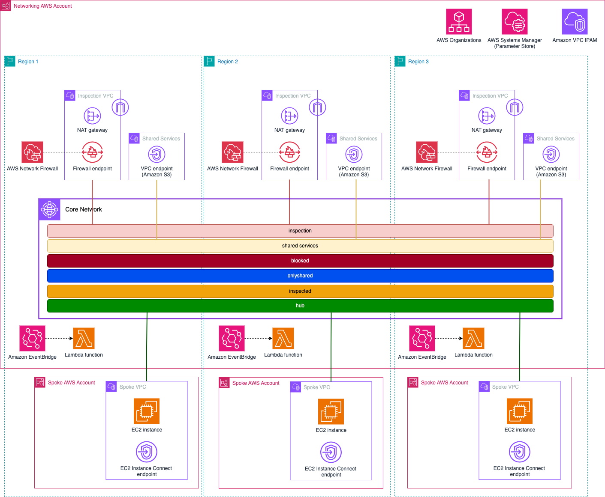

## Build and enforce network security in multi-Account environments

In this repository, you will leverage [Amazon GuardDuty](https://aws.amazon.com/guardduty/) and [AWS Firewall Manager](https://aws.amazon.com/es/firewall-manager/) to control the security posture of the AWS environment. In addition, from GuardDuty findings, you will automate actions in the global network built by [AWS Cloud WAN](https://aws.amazon.com/cloud-wan/). The Infrastructure-as-Code framework used is **Terraform**.

The main idea is to build two different security controls:

* *Reactive*: From GuardDuty findings, an automation will update Cloud WAN VPC attachment tags to move the VPC to a different security level (depending the finding severity).
* *Proactive*: Firewall Manager will monitor the Security Groups in the multi-Account environment to determine which ones are not compliant.



This example requires the use of 2 AWS Accounts: one for the central Networking, Security and automation resources; and another one for the spoke VPCs. The following resources are created in 3 AWS Regions (**us-east-1**, **us-east-2**, and **eu-west-1**):

**Networking Account**

* AWS Network Manager global network and AWS Cloud WAN core network. The core network policy builds the following segments:
    * `hub` segment is the default segment for any VPC connecting the network. VPCs can communicate between each other without restrictions, there's access to a Shared Services VPC, and egress traffic is sent to a central egress & inspection VPC.
    * `inspected` segment. Traffic between VPCs is sent to a central inspection VPC (also used for egress traffic). There's access to a Shared Services VPC.
    * `onlyshared` segment. Isolated segment, only access to Shared Services VPC.
    * `blocked` segment. Isolated segment, VPCs in this segment don't have any communication outside their own VPC.
* Automation:
    * [Amazon EventBridge](https://aws.amazon.com/eventbridge/) rule invoking a Lambda function from GuardDuty findings.
    * [AWS Lambda](https://aws.amazon.com/pm/lambda/) function changing VPC Cloud WAN attachment tags depending the GuardDuty finding obtained.
* In each AWS Region, a Firewall Manager policy checks the Security Groups of the spoke VPCs to make sure they are compliant.
* [Amazon VPC IPAM](https://docs.aws.amazon.com/vpc/latest/ipam/what-it-is-ipam.html) to provide CIDR blocks to the VPCs created in the spoke AWS Account.
* In each AWS Region, two central VPCs are created:
    * Inspection & Egress VPC, with [AWS Network Firewall](https://aws.amazon.com/network-firewall/) as inspection layer.
    * Shared Services VPC, with central [Amazon S3](https://aws.amazon.com/pm/serv-s3/) VPC endpoint access.
* [Amazon Route 53 Profiles](https://docs.aws.amazon.com/Route53/latest/DeveloperGuide/profiles.html) to share [Private Hosted Zones](https://docs.aws.amazon.com/Route53/latest/DeveloperGuide/hosted-zones-private.html) with the S3 VPC endpoint resolution.
* [AWS Systems Manager Parameter Store](https://docs.aws.amazon.com/systems-manager/latest/userguide/systems-manager-parameter-store.html) is used to share information between AWS Accounts - for example, IPAM pool ID or Core Network ARN.

**Spoke Account**

* In each AWS Region used:
    * Amazon VPC connected to Cloud WAN, and using an IPAM pool to obtain a CIDR block.
    * [Amazon EC2](https://aws.amazon.com/ec2/) instances in each Availability Zone - to test connectivity.
    * [EC2 Instance Connect endpoints](https://docs.aws.amazon.com/AWSEC2/latest/UserGuide/connect-using-eice.html) to connect privately to the EC2 instances.

## Pre-requisites

* When using several AWS Accounts, make sure you use different AWS credentials when initializing the provider in each folder.
* [AWS Organizations](https://docs.aws.amazon.com/organizations/latest/userguide/orgs_introduction.html) and [AWS Config](https://docs.aws.amazon.com/config/latest/developerguide/WhatIsConfig.html) should be enabled in your AWS Account(s) to use Firewall Manager. Check the [documentation](https://docs.aws.amazon.com/waf/latest/developerguide/fms-prereq.html) to understand the prerequisites needed to enable Firewall Manager.
* This repository does not configure Amazon GuardDuty. Check the [documentation](https://docs.aws.amazon.com/guardduty/latest/ug/guardduty_settingup.html) to understand how to enable it in your AWS Accounts (if not done already).
* Terraform installed.

## Code Principles

* Writing DRY (Do No Repeat Yourself) code using a modular design pattern.

## Usage

* Clone the repository

```
git clone https://github.com/aws-samples/build-enforce-network-security-multi-account-environments.git
```

* Edit the *variables.tf* file in each folder to configure the environment:
    * AWS Regions to use.
    * Amazon GuardDuty findings to test.
    * EC2 Instance types.
* To share parameters between AWS Accounts, you will need to provide the Account ID of the corresponding Account in each folder. We recommend the use of tha *tfvars* file.

## Deployment

* **Step 1**: Networking Account resources

```
cd network/
terraform apply
```

* **Step 2**: Spoke Account resources

```
cd spoke/
terraform apply
```

## Cleanup

* **Step 1**: Spoke Account resources

```
cd spoke/
terraform apply
```

* **Step 2**: Networking Account resources

```
cd network/
terraform apply
```

## Security

See [CONTRIBUTING](CONTRIBUTING.md#security-issue-notifications) for more information.

## License

This library is licensed under the MIT-0 License. See the LICENSE file.

